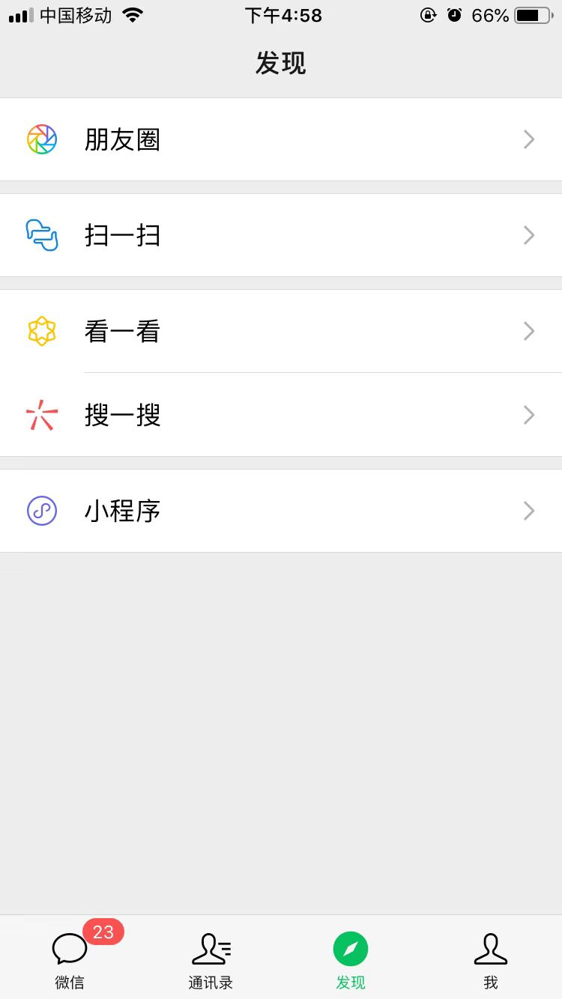

# px、em、rem以及rpx的关系（文末常见1px问题）
一篇很全、emmm也很晦涩的文章：

[CSS像素、物理像素、逻辑像素、设备像素比、PPI、Viewport](https://github.com/jawil/blog/issues/21)
>前端发展到现在，已经可以在各种设备（pc、phone、pad、大屏）上看到它的影子，伴随而来的一个问题就是各尺寸的适配问题。我们写一个宽度100px的元素，为什么在不同的设备上，给人的感觉不一样（你可能会说，在大屏设备上这100px看起来会显得比较渺小），那为什么在同一个设备不同分辨率下，给人的感觉不一样。所以前端适配，归根结底是分辨率的适配。

比较常见的一个场景、老年人喜欢把电脑分辨率调低，因为这样电脑上的字会显得比较大，为什么呢？道理很简单：在未做适配的情况下，假设一个电脑的分辨率分为2000乘以100、1000乘以500两种情况，那么宽度为1000px的元素，在前者看起来就占屏幕的一半、后者就是撑满整屏的效果，又因为屏幕的物理尺寸是不会变的，所以后者（低分辨率）看起来就比较大。

>总结：相同px值，在不同分辨率下，视觉宽度、高度是不同的。高分辨率，全屏模式的宽度可能是2000px，低分辨率下，全屏模式，可能只有1500px，所以高分辨率、改变窗口大小到1500px，就可以模拟低分辨率下全屏模式。

## px和物理像素
px像素（Pixel），像素px是相对于显示器屏幕分辨率而言的。

显示的原理就是把要显示的数据写入显存区域，然后显示设备读取这些数据，驱动硬件就可以显示了。显示的数据是以像素为单位的，一个像素只能显示一种颜色，但是根据显示颜色的总数不同，每个像素占的位数也不同。如果我想显示黑白，那一位就可以存储了，但如果我想显示16种颜色，就得4位来存储一个颜色，这样的一个存储单位就叫做物理像素。

我们写样式时一个像素记作1px，但是css的px和物理像素是一一对应的吗，是同样的概念么？在pc端是这样的，因为屏幕足够大，一个css像素用一个物理像素来显示，完全可以，pc端默认情况下一个css像素就对应着一个物理像素，但是有没有发现你把分辨率调小以后，显示的内容变大了，但是显示器的物理像素肯定不会变啊，这时候其实就是一个css像素对应着若干个物理像素了，这个是与用户设置有关。

移动设备大小是有限的，而且分辨率不低，甚至比pc端更高，也就是可以显示的物理像素更多，如果和pc端一样，一个css的px和物理像素一一对应，可以想象，显示的内容有多小。这样肯定是不行的，解决这个问题，我们可以很自然的想到，那在移动设备上就别一一对应了，一个css的px对应多个物理像素吧，这样就不至于显示的内容过小了，实际上移动设备也是这么做的，你在开发时写的px和最终渲染显示的物理像素数不是一比一的，可能一个px对应2个物理像素，可能3个物理像素，设备显示的物理像素数和你css的px数的比值就叫做设备像素比（device pixel radio），简称dpr。好了，这样显示内容过小的问题就解决了。

有了dpr之后，有一个问题就是同样的一张图片，我设了宽高的px数，那么在dpr为1的设备上，和dpr为2的设备上显示的效果是一样的，1个px在dpr为1的设备上会用1个物理像素来显示，在dpr为2的设备上会用2*2个物理像素来显示，这样dpr高的优势就体现不出来了，我设备比他的好，你给我的体验是一样的，可能有些用户不爽，我们可以区分对待，对于高dpr的设备，用物理像素更多的高清图片来替代，也就是2x图，3x图等等。

## em
em是相对长度单位。相对于当前对象内文本的字体尺寸。如当前对行内文本的字体尺寸未被人为设置，则相对于浏览器的默认字体尺寸。

* em 的值并不是固定的；
* em 会继承父级元素的字体大小。

>注意：任意浏览器的默认字体高都是16px。所有未经调整的浏览器都符合: 1em=16px。那么12px=0.75em,10px=0.625em。为了简化font-size的换算，需要在css中的body选择器中声明Font-size=62.5%，这就使em值变为 16px*62.5%=10px, 这样12px=1.2em, 10px=1em, 也就是说只需要将你的原来的px数值除以10，然后换上em作为单位就行了。
所以我们在写CSS的时候，需要注意两点：

>1. body选择器中声明Font-size=62.5%；
2. 将你的原来的px数值除以10，然后换上em作为单位；
3. 重新计算那些被放大的字体的em数值，避免字体大小的重复声明。

>也就是避免1.2 * 1.2= 1.44的现象。比如说你在#content中声明了字体大小为1.2em，那么在声明p的字体大小时就只能是1em，而不是1.2em, 因为此em非彼em，它因继承#content的字体高而变为了1em=12px。

## rem
rem是CSS3新增的一个相对单位（root em，根em），它与em有什么区别呢？区别在于使用rem为元素设定字体大小时，仍然是相对大小，但相对的只是HTML根元素。这个单位可谓集相对大小和绝对大小的优点于一身，通过它既可以做到只修改根元素就成比例地调整所有字体大小，又可以避免字体大小逐层复合的连锁反应。目前，除了IE8及更早版本外，所有浏览器均已支持rem。对于不支持它的浏览器，应对方法也很简单，就是多写一个绝对单位的声明。这些浏览器会忽略用rem设定的字体大小。下面就是一个例子：

```
p {font-size:14px; font-size:.875rem;}

```
移动设备的宽度是各种各样的，每个设备的dpr也不同，换句话说就是不同设备每一行的物理像素数不同，能显示的css的px数也不同，如果我们写死px的话，那么后果就是同样的px，在不同设备中显示的行数不同，这样整个排版就乱了，分析一下造成显示效果不同的原因就是设备宽度不同，你可能会问，那dpr呢，其实与dpr一点关系都没有，想象一下2个宽度为1000个物理像素的设备，一个dpr为1，一个dpr为2，那么在我们看来不过一个是1000px，一个是500px而已，在这里我们感知不到dpr。那么设备宽度不同怎么做适配呢，其实很容易的会想到，每个设备每行显示的px数不同，你写死px数的话，那肯定显示的效果不一样，所以，不能写死，要动态的计算。对，实际上也是这么解决的，那怎么计算呢，很简单，你把一个设备的样式写好了，其他的根据设备的宽度（px数）的比，来动态计算就行了。


rem就是解决这个问题的，rem不是具体的px，rem具体显示多少像素，是根据根元素的font-size来计算的，比如说你设置了1.2rem，根元素的font-size是100px，那么这个元素动态算出来的px数就是120px。不同宽度，设置不同px，这样就可以适配所有宽度的设备了。看一下实际开发中我们动态计算根元素font-size的代码：

```
// 伪代码
var  根元素fontsize =  实际设备宽度 / 开发时设备宽度 * 开发时根元素font-size

// 具体代码是：（假设开发时我们适配的是iphone6，也就是375px的设备，我们开发时根元素font-size设为了100px）
document.documentElement.style.fontSize =(document.documentElement.offsetWidth/375)*100 + 'px' ;

```
其实除了根据设备宽度比例计算具体px还有一种思路，我们可以根据设备宽度不同，给不同元素设置不同的px不就行了，这也是一种思路，媒体查询可以做到这个，也有些网站是这么做的，但是这样不能兼顾所有的设备，因为你不可能设置很多套样式，只会在关键的几个设备宽，设置几套，而动态计算的方式，可以适配所有的宽度。

## rpx
微信小程序开发时用的是前端的技术，类似html的组件标签，css，js，他面临的问题和网页一样，就是不同宽度的设备的适配，解决思路当然也是一样，但是有一点不同的是不能用rem，为什么呢，因为根本就没有html元素啊，咋解决，很简单，我不基于html的font-size了，我基于一个别的值就行了，你也不需要计算这个值，我给你计算了，这就是rpx。最终的效果就是，你开发时在iphon6的设计稿上量了多少px，就写多少rpx就行了，完美适配，perfect！

>声明：以上所述px为css中定义的像素（以下简称css像素），与实际的物理像素是有区别的，早期电脑屏幕的物理像素与css像素相同，但是随着科技的发展，高精度屏幕开始出现在人们的视野中。以iPhone的Retina屏为例，其物理像素与css像素关系如下所示：
>


>为此移动端浏览器以及某些桌面浏览器引入了devicePixelRatio（DPR）属性，其官方的定义为：设备物理像素和设备独立像素的比例，也就是 devicePixelRatio = 物理像素 / 独立像素。而css像素=独立像素，由此我们可以得出 devicePixelRatio = 物理像素 / css像素，进而可以推算出该设备上一个css像素代表几个物理像素。例如iPhone的retina屏的devicePixelRatio = 2，那么该设备上一个css像素相当于2个物理像素。

## 移动端常见1px问题
根据rem乘以根元素font-size算出的px值有小数，最终是零点几px咋办，不同浏览器对这个支持程度不同，有的只渲染出零点几px对应的物理像素，有的干脆都显示1px，后果就是，同样的rem值，在不同dpr的设备上宽度不同，最常见的就是边框，有的设备上显得特宽，特别扭，也就是经典的1px边框问题。

>一开始一直弄不明白移动端1px变粗的问题根源，因为自己也做过移动hybrid开发，感觉并没有遇到过类似的问题呀，直到后来才意识到，原来一直存在这个问题，只是自己没有发现而已。(如下图，左图边框应该是正常1px的粗细，右图就是我们常说的1px变粗的现象）
>



>UI设计标注图的时候，一般会以iPhone6尺寸（物理像素）为基准，即750px乘以1344px的尺寸去设计，而我们知道，FE开发的时候，是需要将**设计稿标注的尺寸除以2**再去开发的，原因看下面的文章就知道了，但是写border的时候，一般不会注意，顺手写成1px，但其实**不是1px变粗了，只是实际只是需要0.5px而已**，参考下文：
>
>[1px边框在移动端变粗问题产生的原理](https://segmentfault.com/q/1010000012141120)

[走向视网膜（Retina）的Web时代](https://www.w3cplus.com/css/towards-retina-web.html)

[移动前端开发之viewport的深入理解](http://www.cnblogs.com/2050/p/3877280.html#!comments)

[视网膜New iPad与普通分辨率iPad页面的兼容处理](https://www.zhangxinxu.com/wordpress/2012/10/new-pad-retina-devicepixelratio-css-page/)

### 1px解决方案
1、用小数来写px值

缺点：存在兼容性问题，只支持ios8+设备。0.5px识别不了，无法兼容安卓设备、iOS8以下设备显示成0px。

```
.border { border: 1px solid #999 }
@media screen and (-webkit-min-device-pixel-ratio: 2) {
    .border { border: 0.5px solid #999 }
}
@media screen and (-webkit-min-device-pixel-ratio: 3) {
    .border { border: 0.333333px solid #999 }
}
```
2、meta标签中的viewport属性，配合rem单位使用，这也是著名的iOS端适配解决方案[flexible.js](https://github.com/amfe/lib-flexible)的实现思路,rem按照设计稿标准走即可，不需要使用除以2以后的值。

缺点：存在兼容性问题，Android部分机型不支持vw，或者设置后无效。

```
if(window.devicePixelRatio){
	let scale = 1/devicePixelRatio;
	metaEl = doc.createElement('meta');
	metaEl.setAttribute('name', 'viewport');
	metaEl.setAttribute('content', 'initial-scale=' + scale + ', maximum-scale=' + scale + ', minimum-scale=' + scale + ', user-scalable=no');
}
```

3、伪类+transform实现，把原先元素的 border 去掉，然后利用 :before 或者 :after 重做border，并transform的scale缩小一半，原先的元素相对定位，新做的 border 绝对定位。

```
<div class="box-shadow-1px scale">box-shadow-1px</div>
<style>
.box-shadow-1px {
    height: 200px;
    width: 200px;
    text-align: center;
    border:1px solid red;
}
.scale{
  position: relative;
  margin-bottom: 20px;
  border:none;
}
.scale:after{
  content: '';
  position: absolute;
  top: 0;
  left: 0;
  border: 1px solid #000;
  -webkit-box-sizing: border-box;
  box-sizing: border-box;
  width: 200%;
  height: 200%;
  -webkit-transform: scale(0.5);
  transform: scale(0.5);
  -webkit-transform-origin: left top;
  transform-origin: left top;
}
</style>
```

4、另外还有很鸡肋的 border-image、CSS3 box-shadow等解决方案，不建议使用，了解即可。
