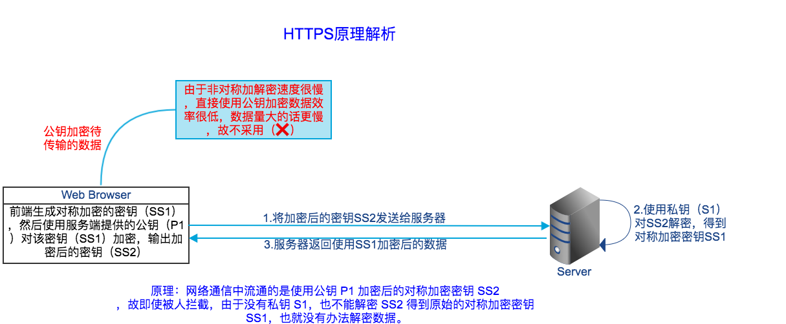
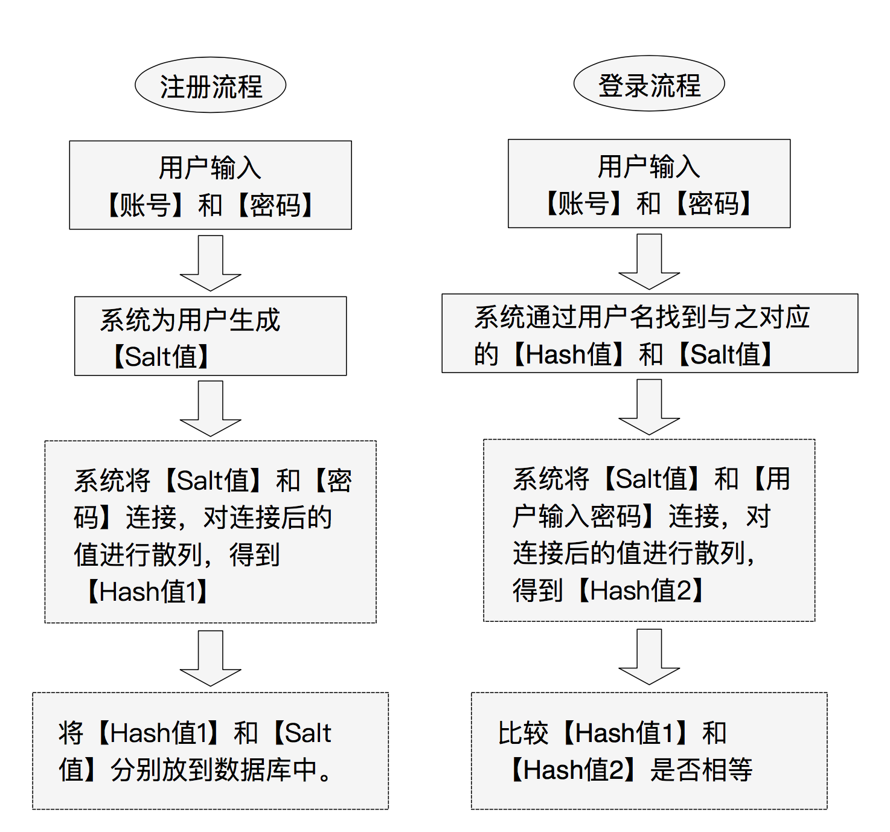

# 通俗易懂讲HTTPS

## 什么是数据安全？
数据传输的安全体现在以下几个方面：

* 我发的数据，不该看的人看不懂（哪怕被别人拦截到，看到的也是一段读不懂、无法还原的乱码）
* 我发的数据，不该看的人不能伪造或者修改（修改后接收方可察觉）
* 我发的数据，过期之后不能拿过来继续用

> 都说HTTPS请求是安全的，那它是怎么保证数据安全的呢？为什么说http是不安全的？

开始之前，需要先对常见的几种加密方式有基本的了解：

1. **单向散列Hash加密**：把任意长度数据经过处理变成一个长度固定唯一的字符串（同一明文一定生成固定的密文），但任何人拿到这个字符串无法反向解密成原始数据（不可逆性），Hash 常用来验证数据的完整性。常见 Hash 算法有 MD5（已经不安全了，可以暴力穷举）、SHA1、SHA256。
2. **对称加密**：加密和解密数据使用同一个密钥。这种加密方式的优点是速度很快，常见对称加密的算法有 AES；
3. **非对称加密**： 加密和解密使用不同的密钥，叫公钥和私钥。数据用公钥加密后必须用私钥解密，数据用私钥加密后必须用公钥解密。一般来说私钥自己保留好，把公钥公开给别人，让别人拿自己的公钥加密数据后发给自己，这样只有自己才能解密。 这种加密方式的特点是速度慢，CPU 开销大，常见非对称加密算法有 RSA；

理解了加密方式后我们就能利用这些算法实现安全数据传输。以一个故事开始（故事转自[饥人谷](https://mp.weixin.qq.com/s/3oVc5n-McRdIHsgcDORZwA)）：

班里来了个新同学小美，长的特别漂亮，小谷暗恋小美很久，终于有一天小谷鼓起勇气向小美表白。小谷写了个纸条：“我是小谷，我喜欢你，你喜欢我吗？” ，让小王转交给小美。

正常情况下，小王会把纸条转给小美，小美看到后很开心，回复了纸条：“我是小美，我也喜欢你”，让小王再转递给小谷。

可是小王也暗恋小美，当然不愿甘做嫁衣。这个时候小王可以有几方法来捣乱：

收到小谷的纸条后扔掉纸条。但这样做小谷收不到回应下课会去单独问小美，事情就败露了
偷窥纸条的内容，然后举报给老师
收到小谷的纸条后，小王立即给小谷发一个回复纸条：“我不喜欢你，我喜欢小王”。同时小王给小美发一个纸条：“我是小谷，你长的真丑，嘿嘿”
正常帮小谷和小美投递纸条，成就美事。但复印一份小谷的纸条，过两天小王把这个纸条发给了班里的其他女生小花，这样小美知道后必然会闹分手
小谷很聪明，早就看出来小王心怀不轨，可是没办法，要传信必然要经过小王，要怪就怪自己太腼腆不敢下课直接亲手送上。怎么办呢？

有一种办法是把纸条的信息加密(AES 加密)，小王就不知道纸条内容了。可是问题来了，小美也不知道密钥，她收到信后也无法解密啊。倒是可以把密钥放到纸条里，可这样小王也得到了密钥等于白忙活一场。

再说说小美，小美很漂亮，在以前的学校被称为数学女神，转学到这里后立即被小谷吸引了，她看出来小谷有点喜欢自己但又不十分确定，她不想主动。她猜到小谷会在上课的时候可能用写纸条的方式表白，也猜到猥琐的小王会在中间捣乱。如何让小谷能顺利向自己表白呢？小美在疯狂的思考：

方案一： 我可以生成一对公钥和私钥，把公钥公开给班里所有的同学。这样小谷就能得到公钥，把要发的信息用公钥加密，只有我自己能用私钥解密。可是我如何把我的回复发出去呢？如果用我的私钥加密，小谷倒是能用公钥解密，但班里任何同学都能解密，被其他同学看到就糗大了。而且如果小谷纸条的内容太多，他用公钥加密需要花一整节课的时间，不能耽误他学习

方案二：我可以生成一对公钥和私钥，把公钥公开给班里所有的同学，这样小谷就能得到公钥。如果小谷够聪明的话，他得到公钥后会生成一个对称加密AES的密钥，然后用我的公钥把 AES 密钥加密(AES 密钥长度很短加密几乎不需要时间)，然后把加密后的密钥发给我。我收到后用我的私钥解密，得到小谷和我约定的对对称加密密钥，然后我们用这个只有我们俩知道的对称密钥加密数据进行交流。

下课休息的时候，小美给班里的同学说：“快数学考试了，我的数学很好，考场上需要要我帮忙的同学可以找我，我公布一下我的公钥，为了安全起见大家用我的公钥加密消息。”

一切貌似天衣无缝，可是小美在班里公布自己公钥的时候小谷正好拉肚子去了厕所，回来之后才知道这事，小谷于是问旁边的同学小花小美公钥是多少。小花以前是班里受欢迎的女生被很多男生仰慕，在小美来之后立即被夺了风头，一直怀恨在心。于是小花告诉了小谷一个假公钥，其实是自己生成的公钥。这样万一小谷找小美要小抄，自己可以冒充小美给一个错答案。

一切被小美看到眼里，这样不行啊， 别到时候自己和小谷的好事没成，反而同学考试被陷害栽赃到自己头上。怎么办呢？对了，班长是班里人品很正的人，可以用班长给自己做信用背书，正好前两天班长在班里通知了自己的公钥。 于是小美找到班长，做了一个证书，证书上有自己的名字、学号、公钥、公证人班长的名字，同时把这些信息通过 Hash (sha256)处理后请求班长用自己的私钥进行加密（为什么用 Hash 处理？因为东西太多非对称加密很费时），也放到证书上。于是小美再次把证书通报给班里所有的同学。

小谷这次得到了证书，发现上面的公证人是班长，于是先用班长的公钥对证书上被班长私钥加密后的字段进行解密，得到元素数据的 Hash。 再对元素数据进行 Hash和刚刚解密的 Hash 进行比对。如果比对成功表示证书上的信息无误，且是由班长担保的。这时候小谷确信证书上的公钥就是小美的。任何人因为没有班长的私钥都无法伪造证书。

你以为故事就这么圆满结束了吗？其实没有，班长前两天在公布自己的证书的时候小谷正好生病请假了。 他根本不知道班长的公钥是不是他本人的。

这个时候他发现班长的证书上有班主任的担保（班主任的公钥做了签名），班主任的证书上有校长的担保，而小谷是有校长的的公钥的，就印在学生证上。

终于，小谷收获了女神的芳心。

故事完了。故事中 小谷是浏览器，小美是服务器，小花和小王是坏蛋，班长是 CA 机构，班主任是上级 CA，校长是根 CA 服务器。当一个网站要使用 https 时先需在一些国际认证的 CA 机构填写网站信息申请证书，而这些 CA机构往往还有上层 CA，最终有一个根 CA。一般来说浏览器都会内置根 CA 和一些顶级 CA 的证书，但需要验证的时候会通过 CA 链逐级验证。

总结下来就是如下图所示流程：

## HTTP 与 HTTPS 的区别

| 参数 | HTTP | HTTPS |  
| ---- | ---- | ---- | 
| 写法 | http:// | https:// |
| 默认端口 | 80 | 443 |
| 认证 | 不需要认证 | 需要SSL证书认证 |
| 安全性 | 不安全，容易受中间人、劫持攻击等 | 安全 |
| 数据 | 没有加密 | 数据已加密 |
| 协议 |  TCP / IP |  TCP / IP 的基础上增加了 TLS / SSL 加密 |
| 访问速度 | 快 | 不如HTTP快 |

> #### 加餐：MD5介绍及常见应用场景
> MD5加密使用的是hash算法，一种被广泛使用的密码散列函数，可以产生出一个128位（16字节）的散列值（hash value），也就是一共有2^128种可能，大概是3.4*10^38，这个数字是有限多个的，而但是世界上可以被用来加密的原文则会有无数的可能性。也就是说可能存在多个原始数据使用MD5加密后对应同一个值，也就是大名鼎鼎的md5碰撞问题。

> 为了防止用户登录密码泄露，数据库存储的密码不能是明文，即使数据库泄露了密码也不能直接泄露。通常的做法是将用户设置的登录密码进行MD5运算/加密后存入数据库。当用户登录时，对用户输入的密码进行MD5运算，运算结果与数据库中的值进行比对，如果MD5密文一样，则认为用户登录密码正确，反之则认为密码错误。

> 由于MD5可以暴力破解，虽然比较难，但还是可以实现，所以为了提高MD5的安全系数，提出了‘加盐’的概念
> 