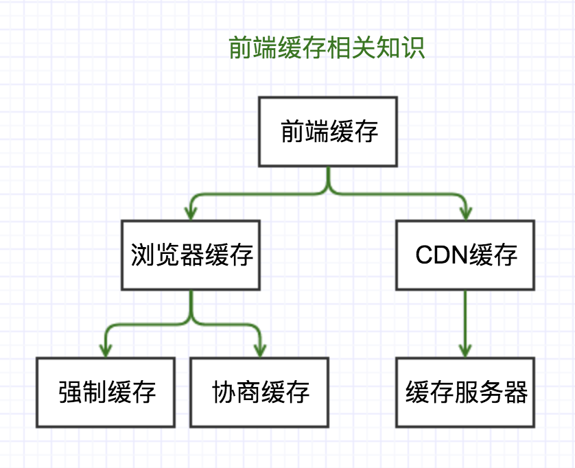
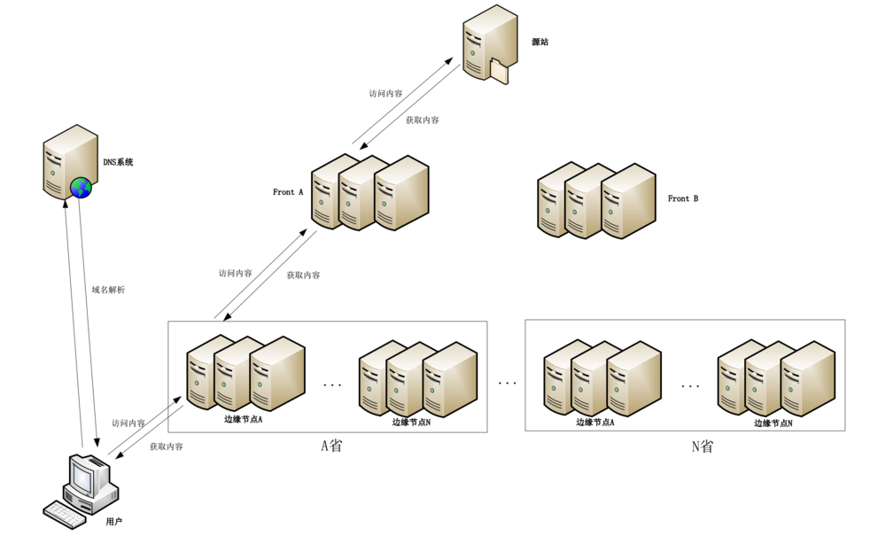
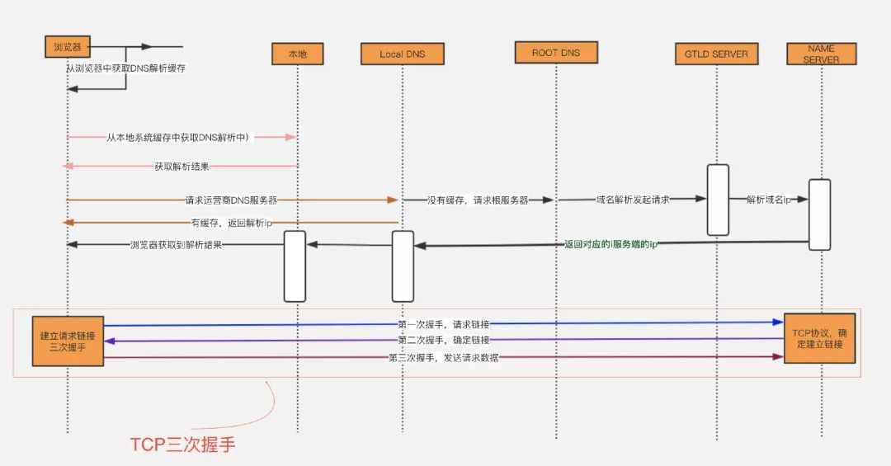
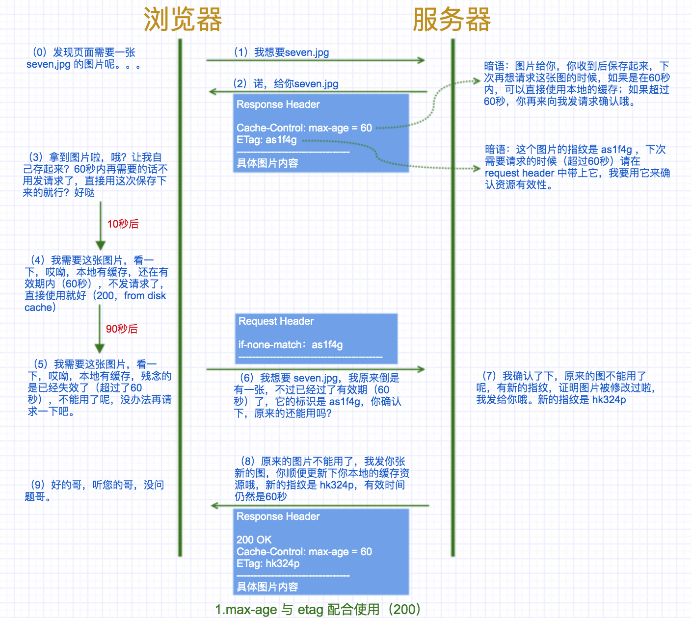
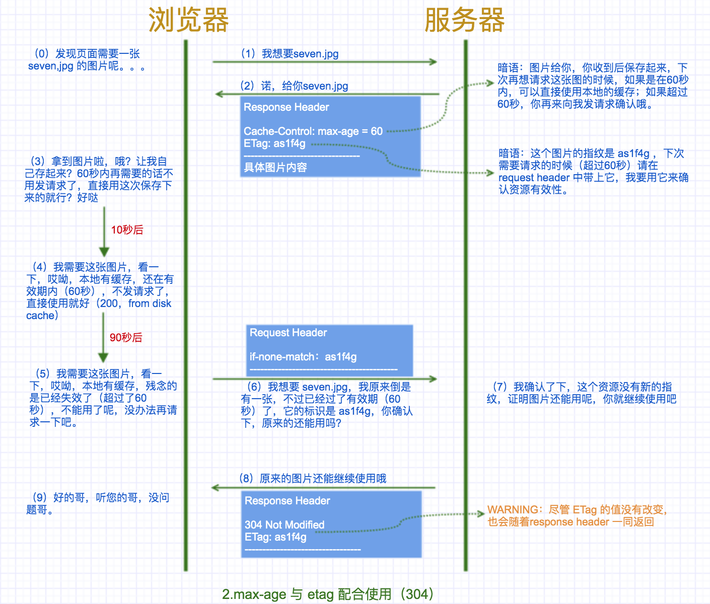
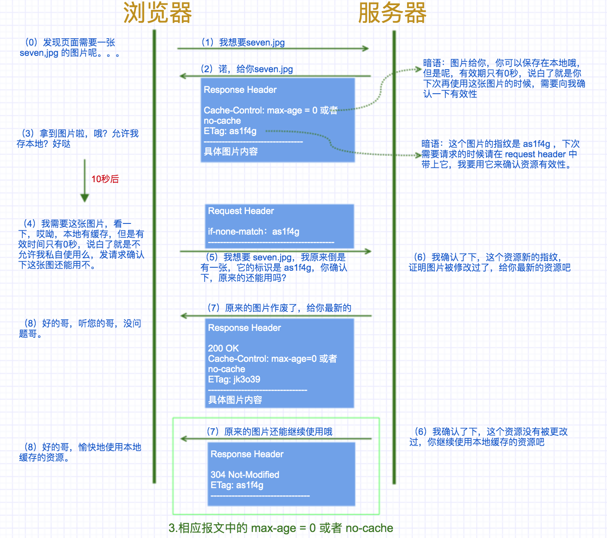
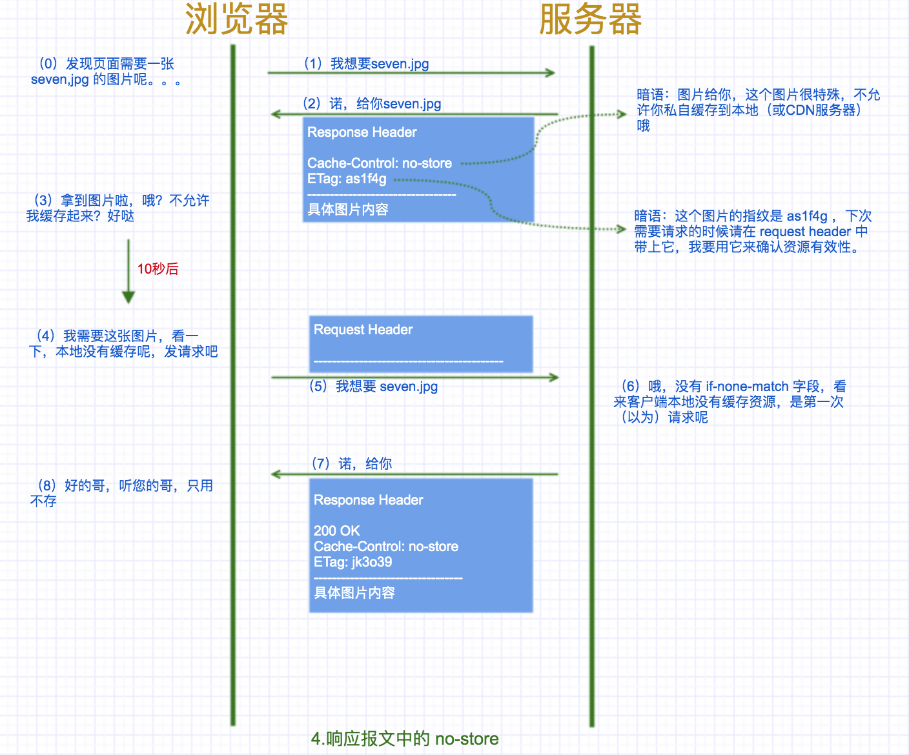
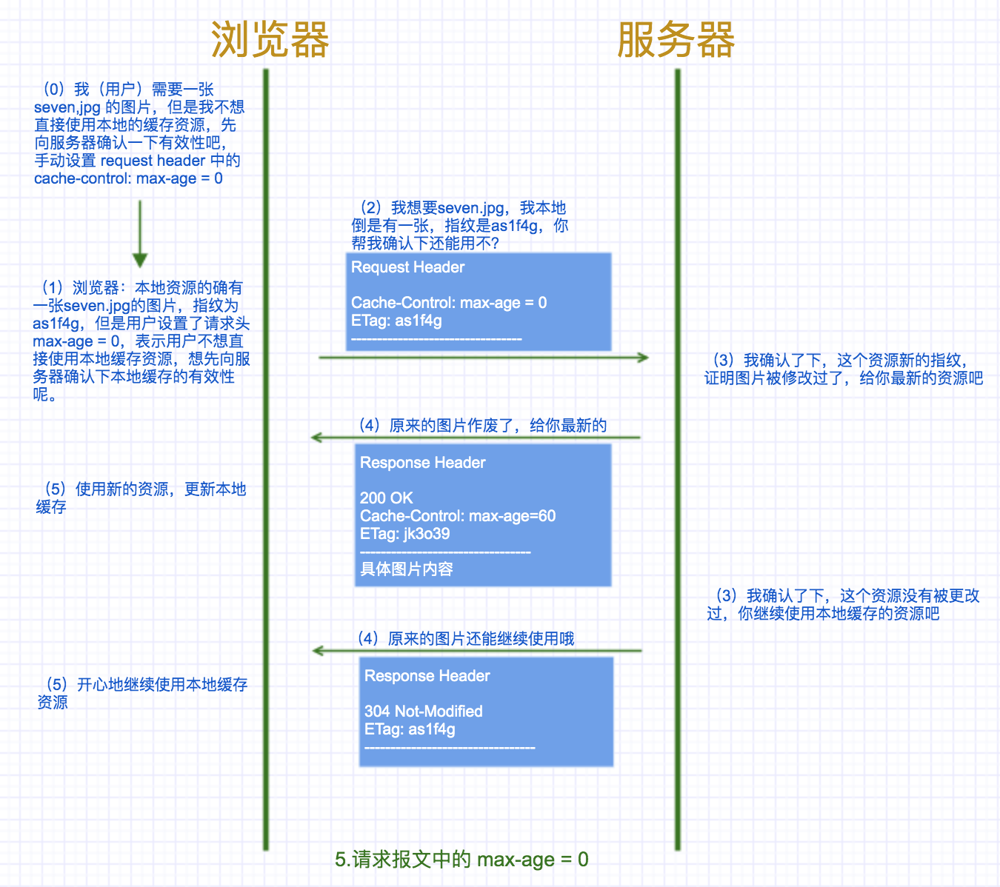
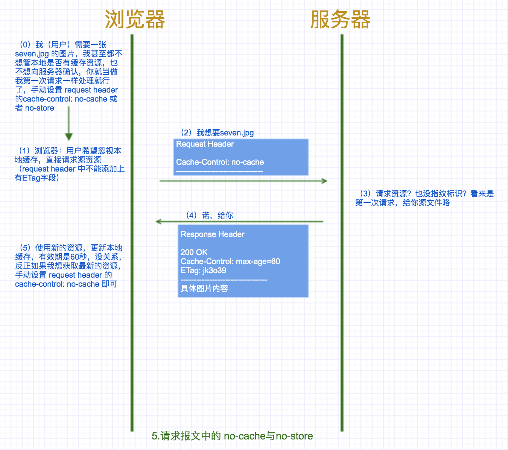

# 前端缓存之浏览器缓存（强缓存+协商缓存） Vs CDN缓存（缓存服务器）

> ###Q1：何为缓存？
> 我知道，但我不说。（浏览器通过网络下载各种各样的资源，例如 HTML、CSS、JavaScript、图片、视频、音频、字体等等，这是浏览器工作过程的第一步，也是非常耗时的一步。其实，很多静态文件，如 HTML 文本、图片等，这些资源不经常发生变化，完全可以储存在客户端( 保存到本地磁盘中 )，以便下次使用。因此，浏览器引入了资源缓存机制，也叫 HTTP 缓存机制。读取本地文件的速度远远快于服务器）
> ###Q2：为什么要用缓存？（缓存的重要性）
1. 减少了不必要的数据传输，节省带宽；
2. 减少服务器的负担，提升网站性能；
3. 加快了客户端加载网页的速度；
4. 用户体验友好。

> ###Q3：缓存这么好，就没点缺点？
> 纵然缓存有如此多的优点，也不能一味地使用缓存，因为资源如果有更改但是客户端不及时更新会造成用户获取信息滞后。
> 
> ### 结论：为了合理使用缓存，各种缓存策略应运而生！

## 浏览器缓存
浏览器缓存分为**强缓存**和**协商缓存**两种。

### 强缓存
到底什么是强缓存？强在哪？其实强是强制使用的意思。当浏览器去请求某个文件的时候，根据之前（想用本地缓存，前提条件是本地得有缓存么，所以肯定是之前请求过服务器，服务器正常返回过缓存内容）服务器返回的 response header 中的 Expires 或者 Cache-Control 两个字段来控制的，用来表示资源的缓存时间。

1. Expires
该字段是 http1.0 时的规范，它的值为一个绝对时间的GMT格式的时间字符串，比如`Expires:Mon,18 Oct 2066 23:59:59 GMT`。这个时间代表着这个资源的失效时间，在此时间之前，即命中缓存。这种方式有一个明显的缺点，由于失效时间是一个绝对时间，所以当服务器与客户端时间偏差较大时，就会导致缓存混乱。修改系统时间也会导致缓存使用混乱。

1. Cache-Control
Cache-Control是 http1.1 时出现的header信息，主要是利用该字段的max-age值来进行判断，它是一个相对时间，例如Cache-Control:
	* max-age=3600，代表着资源的有效期是3600秒。cache-control除了该字段外，还有下面几个比较常用的设置值：
	* no-cache：不使用本地缓存。需要使用缓存协商，先与服务器确认返回的响应是否被更改，如果之前的响应中存在ETag，那么请求的时候会与服务端验证，如果资源未被更改，则可以避免重新下载。
	* no-store：直接禁止游览器缓存数据，每次用户请求该资源，都会向服务器发送一个请求，每次都会下载完整的资源。
	* public：可以被所有的用户缓存，包括终端用户和CDN等中间代理服务器。
	* private：只能被终端用户的浏览器缓存，不允许CDN等中继缓存服务器对其缓存。
	
> Cache-Control与Expires可以在服务端配置同时启用，同时启用的时候Cache-Control优先级高。
> 
> 当 Cache-Control 出现在 request header 中，cache-control:no-cache 告诉HTTP消息链上的缓存系统(也就是浏览器的缓存和代理服务器上的缓存)，本次请求要求忽略一切缓存，必须是原始服务器重新计算生成回应给用户。所以，即使浏览器上的本地缓存未过期，或者代理服务器上的缓存未过期，都不要将这些缓存作为回应。当我们在浏览器中强制刷新页面（按ctrl+F5），发送的就是这个头（不同很多浏览器将cache-contro:no-cache和pragam:no-cache两个头一起发送）
> 
`pragma:no-cache`：和cache-control:no-cache一样，不过出于兼容HTTP/1.0，所以有些浏览器会保留这个头。注意pragma:no-cache只应该出现在Request中，表明不想获取缓存。HTTP没有哪条条文对Response中的pragma:no-cache进行定义，所以Response中的pragma:no-cache是无效的。

##### 强缓存的应用
强缓存是前端性能优化最有力的工具，对于有大量静态资源的网页，一定要利用强缓存，提高响应速度，通常是为这些静态资源全部配置一个超时时间超长的Expires或Cache-Control，这样用户只会在第一次访问网站时加载静态资源，其他时间只要缓存没有失效并且用户没有强制刷新的条件下都会从缓存中加载。然而这种缓存配置方式会带来一个问题，就是当资源更新时，客户端由于有缓存不会向服务器请求最新的资源，这个问题已有解决方案：通过更新页面中引用的资源路径，让浏览器主动放弃缓存，加载新资源。但要实现有更新的文件才需要浏览器重新加载，因此必须让url的修改与文件内容相关联，利用数据摘要算法对文件求摘要信息，摘要信息与文件内容一一对应，这一点许多前端构建工具都做到了，如webpack。

### 协商缓存

强缓存就是浏览器根据缓存失效时间等策略，命中缓存，直接返回本地缓存内容，此时这个http请求甚至都没有发送至客户端（status code 返回的仍是 200，只不过显示的是 from disk cache）。

与之对应的就是协商缓存，何为协商缓存，顾名思义，需要协商，单纯一方是无法决定的。哪几方协商？浏览器与服务器。

总结下来就是强缓存就是给资源设置个过期时间，客户端每次请求资源时都会看是否过期；只有在过期才会去询问服务器。所以，强缓存就是为了给客户端自给自足用的。而当某天，客户端请求该资源时发现其过期了，这是就会去请求服务器了，而这时候去请求服务器的这过程就可以设置协商缓存。这时候，协商缓存就是需要客户端和服务器两端进行交互的。

> 注意：对比缓存的优先级低于强制缓存，因此只有在强制缓存失效后，客户端才会携带缓存标识向服务器发起请求。

协商缓存是利用 【Last-Modified、If-Modified-Since】、【ETag、If-None-Match】这两对header来管理的。

1. Last-Modified / If-Modified-Since 当我们第一次发出请求时，Last-Modified 由服务器返回(response header)，通知客户端，该资源的最后修改时间。当我们再次请求该资源时，If-Modified-Since 由客户端发送(request header)，其保存了 Last-Modified 的值。服务器收到请求后，将 If-Modified-Since 的值与被请求资源的最后修改时间进行比对。若资源的最后修改时间大于 If-Modified-Since 的值，说明资源被修改过，则返回状态码 200 以及最新资源；若资源的最后修改时间小于或等于 If-Modified-Since 的值，说明资源无修改，则返回状态码 304，通知客户端继续使用缓存资源。
2. ETag / If-None-Match 当我们第一次发出请求时，ETag 由服务器返回，其值为该资源的标签。当我们再次请求该资源时，If-None-Match 由客户端发送，其保存了 ETag 的值。服务器收到请求后，将 If-None-Match 的值与被请求资源的标签进行比对。若资源的标签不等于 If-None-Match 的值，说明资源被修改过，则返回状态码 200 以及最新资源；若资源的标签等于 If-None-Match 的值，说明资源无修改，则返回状态码 304，通知客户端继续使用缓存资源。

> ETag / If-None-Match 组合的优先级高于 Last-Modified / If-Modified-Since 组合。服务器会优先验证ETag，一致的情况下，才会继续比对Last-Modified，最后才决定是否返回304。

##### 既生亮（Last-Modified）何生瑜（ETag）
你可能会觉得使用 Last-Modified 已经足以让浏览器知道本地的缓存副本是否足够新，为什么还需要 Etag 呢？HTTP1.1 中 Etag 的出现主要是为了解决几个 Last-Modified 比较难解决的问题：

* 一些文件也许会周期性的更改，但是他的内容并不改变(仅仅改变的修改时间)，这个时候我们并不希望客户端认为这个文件被修改了，而重新GET；
* 某些文件修改非常频繁，比如在秒以下的时间内进行修改，(比方说1s内修改了N次)，If-Modified-Since能检查到的粒度是s级的，这种修改无法判断(或者说UNIX记录MTIME只能精确到秒)；
* 某些服务器不能精确的得到文件的最后修改时间。

### 强缓存与协商缓存的区别
| 缓存类型	| 获取资源形式	| 状态码 | 发送请求到服务器 |
| ---- | ---- | ---- | ---- | 
| 强缓存| 从缓存取 | 200（from cache）|	否，直接从缓存取 | 
| 协商缓存	| 从缓存取	| 304（Not Modified） | 是，通过服务器来告知缓存是否可用 |

### 用户行为对缓存的影响
| 用户操作	| Expires/Cache-Control | Last-Modied/Etag |
| ---- | ---- | ---- |
| 地址栏回车 |	有效 |有效 |
|页面链接跳转 | 有效 | 有效 |
|新开窗口 | 有效 | 有效 |
|前进回退 | 有效 | 有效 |
|F5刷新 | 无效 | 有效 |
|Ctrl+F5强制刷新 | 无效 | 无效 |

## CDN 缓存

> CDN 维基百科给出的解释是：内容分发网络（Content delivery network或Content distribution network，缩写：CDN）。简单来说它主要的工作是把我们需要被分发的内容分发到世界各地的各个节点上，让世界各地的人都可以在距离最近的网络节点拿到想要拿到的内容，减少网络传输距离从而达到加速的目的（需要提供资源绝对地址告诉cdn厂商，让厂商去智能拉取）。

通俗的来说，CDN在浏览器与源服务器之间扮演了中间服务器的角色，结合上文讲述的浏览器缓存，在本地缓存失效要去请求最新的资源的情况下，如果配置了CDN，则请求可能都到不了最终的源服务器，中途就返回了想要的内容（提高响应速度）

客户端访问网站的过程：

* 没有CDN：
	1. 	用户在浏览器访问栏中输入要访问的域名；
	2. 浏览器向DNS服务器请求对该域名的解析；
	3. DNS服务器返回该域名的IP地址给浏览器；
	4. 浏览器使用该IP地址向服务器请求内容；
	5. 服务器将用户请求的内容返回给浏览器。

* 使用了CDN：
	1. 用户在浏览器中输入要访问的域名；
	2. 浏览器向DNS服务器请求对域名进行解析。由于CDN对域名解析进行了调整，DNS服务器会最终将域名的解析权交给CNAME指向的CDN专用DNS服务器；
	3. CDN的DNS服务器将CDN的负载均衡设备IP地址返回给用户；
	4. 用户向CDN的负载均衡设备发起内容URL访问请求；
	5. CDN负载均衡设备会为用户选择一台合适的缓存服务器提供服务。选择的依据包括：根据用户IP地址，判断哪一台服务器距离用户最近；根据用户所请求的URL中携带的内容名称，判断哪一台服务器上有用户所需内容；查询各个服务器的负载情况，判断哪一台服务器的负载较小。基于以上这些依据的综合分析之后，负载均衡设置会把缓存服务器的IP地址返回给用户；
	6. 用户向缓存服务器发出请求；
	7. 缓存服务器响应用户请求，将用户所需内容传送到用户。如果这台缓存服务器上并没有用户想要的内容，而负载均衡设备依然将它分配给了用户，那么这台服务器就要向它的上一级缓存服务器请求内容，直至追溯到网站的源服务器将内容拉取到本地。

### CDN 缓存
使用了CDN的场景下，在用户第一次访问网站后，网站的一些静态资源如图片等就会被下载到本地，作为缓存，当用户第二次访问该网站的时候，浏览器就会从缓存中加载资源，不用向服务器请求资源，从而提高了网站的访问速度。

而若使用了CDN，当浏览器本地缓存的资源过期之后，浏览器不是直接向源站点请求资源，而是向CDN边缘节点请求资源，CDN边缘节点中也存在缓存，若CDN中的缓存也过期，那就由CDN边缘节点向源站点发出回源请求来获取最新资源。

1. 浏览器缓存以及CDN缓存都有一套判断文件是否需要更新的机制：浏览器在加载资源时，先根据这个资源的一些http header判断它是否命中强缓存，如果命中，浏览器直接从自己的缓存中读取资源，不会发请求到服务器；
2. 当强缓存没有命中的时候，浏览器一定会发送一个请求到服务器，服务器端依据资源的另外一些http header验证这个资源是否命中协商缓存，如果命中，服务器会将这个请求返回，但是不会返回这个资源的数据，而是告诉客户端可以直接从缓存中加载这个资源，于是浏览器还是从自己的缓存中加载资源，当协商缓存也没有命中的时候，浏览器直接从服务器加载资源数据；
3. CDN节点缓存机制在不同服务商中是不同的，但一般都遵循HTTP协议，通过http响应头中的Cache-Control:s-max-age的字段来设置CDN节点文件缓存时间。当客户端向CDN节点请求数据时，CDN会判断缓存数据是否过期，若没有过期，则直接将缓存数据返回给客户端，否则就向源站点发出请求，从源站点拉取最新数据，更新本地缓存，并将最新数据返回给客户端。CDN服务商一般会提供基于文件后缀、目录多个维度来指定CDN缓存时间，为用户提供更精细化的缓存管理。CDN缓存时间会对“回源率”产生直接的影响，若CDN缓存时间短，则数据经常失效，导致频繁回源，增加了源站的负载，同时也增大了访问延时；若缓存时间长，则不能保证文件的时效性。

##### CDN 缓存的优点
* CDN节点解决了跨运营商和跨地域访问的问题，访问延时大大降低（电信的用户访问放置在网通机房的服务器，响应时间特别长，反之亦然。使用CDN技术，可以让电信的用户访问电信的内容缓存服务器，网通的用户访问网通的内容缓存服务器。通过这样一种策略，绕开了网络运营商之间人为设置的障碍）
* 大部分请求在CDN边缘节点完成，CDN起到了分流作用，减轻了源站的负载，解决网站高流量、大并发的问题

##### 不适合 CDN 缓存的场景
* CDN 对于不经常访问的资源是无效的。通常只有在 CDN缓存过期前有至少两次访问的资源才算有效；
* CDN 对于不断变化的资源不适用；
* CDN 对于不想公开资源可能是一个糟糕的选择。
 
 ## 巩固一哈，通俗易懂的几张图
 

 
> ### 加餐：[etag的应用](https://developer.mozilla.org/zh-CN/docs/Web/HTTP/Headers/ETag)
> ETag: `W/"<etag_value>"` // 弱验证器
> 
> ETag: `"<etag_value>"` // 强验证器
> 
> `W/` 可选
'W/'(大小写敏感) 表示使用弱验证器。 弱验证器很容易生成，但不利于比较。 强验证器是比较的理想选择，但很难有效地生成。 相同资源的两个弱Etag值可能语义等同，但不是每个字节都相同。

> `"<etag_value>"` 实体标签唯一地表示所请求的资源。 它们是位于双引号之间的ASCII字符串（如“675af34563dc-tr34”）。 没有明确指定生成ETag值的方法。 通常，使用内容的散列，最后修改时间戳的哈希值，或简单地使用版本号。 例如，MDN使用wiki内容的十六进制数字的哈希值。
> ##### 示例
> ETag: "33a64df551425fcc55e4d42a148795d9f25f89d4"
> 
> ETag: W/"0815"

> ##### 应用场景
> 1. 避免“空中碰撞”
在ETag和 If-Match 头部的帮助下，您可以检测到"空中碰撞"的编辑冲突。
例如，当编辑在线文档时，当前的wiki内容被散列，并在响应中放入Etag：`ETag: "33a64df551425fcc55e4d42a148795d9f25f89d4`，将更改保存到Wiki页面（发布数据）时，POST请求将包含有ETag值的If-Match头来检查是否为最新版本：`If-Match: "33a64df551425fcc55e4d42a148795d9f25f89d4"`如果哈希值不匹配，则意味着文档已经被编辑，抛出[412](https://developer.mozilla.org/zh-CN/docs/Web/HTTP/Status/412)前提条件失败错误，从而避免冲突。
> 2. 缓存未更改的资源（本文提到的应用）