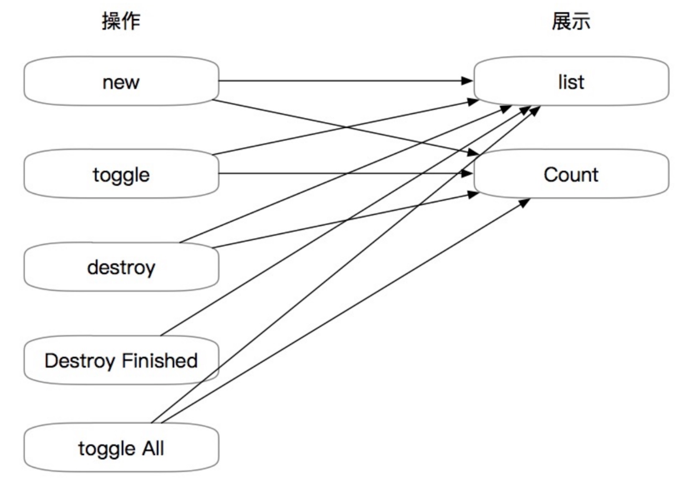
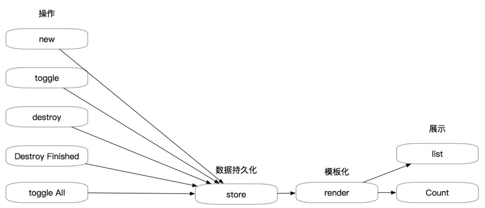

# 重识 MV-*（Whatever）

## 前言

个人认为，前端爆发分为两个节点，一个是jQuery时代，一个是node时代。开始讲MV*之前，我们先回顾下早期的前端开发模式即jQuery时代（及以前），那时候开发模式很简单：请求数据 --> 根据返回数据直接操作DOM(将数据展示到页面中)，如下图所示（一个简单的 Todo list 示例，提供增、删、切换等简单功能）

可以看出来，任何一个操作，都是直接修改页面展示（即DOM），这样做导致的一个不良结果就是，哪怕是引入了jQuery这样的DOM操作神器，代码逻辑看起来也会显得很杂乱、臃肿，后期维护成本很高。

这个时候，为了简化代码逻辑，有些人就引入了中间数据层的概念，配合render函数的使用，使得原本复杂的业务代码变得简单清晰，如下图所示 [各种代码使用MVC模式实现TODO LIST](https://github.com/tastejs/todomvc/tree/master/examples)

可以看出，用户操作页面的时候，直接影响的是数据层的数据，而数据层的改变会触发render函数（数据与DOM的一一对应逻辑写在这里面，依旧是常见的DOM操作），使得render重新渲染页面，最终使得页面做出相应的变化，这就是早期MVC思想的雏形。

这样的代码组织方式带来的最大的好处就是，无需在代码中到处充斥着DOM操作，只需在render函数中实现；其他的地方，只需要维护好相应的数据模型即可。

> 无论是早期的MVC、MVP还是现在的MVVM模式，其中的 M（数据模型层）与 V（视图层）基本都大同小异，所以理解其中的 C 、P 、VM之间的差异，才能真正理解它们的异同。

## MVC

经典MVC根据职责将代码划分为三个区域：Model（模型）、View（视图）、Controller（控制器）。
首先从M、V、C各自的职责说起：

* Model：代表业务逻辑层，它无视表现层的存在，只专注处理业务。
* Controller：接受用户的输入，调度业务逻辑，联系数据和模板之间工作的逻辑代码。
* View：向用户呈现展示的信息，与M建立观察者模式，根据M的改变自动重新渲染。

 

MVC模型的特点：

* C与V共同组成一个表现层，即一个UI组件，两者是无法独立存在的，所以没有实质上的分离。
* 成功将“表现层（C+V）”从“业务逻辑层（M）”剥离出来。
* 引入观察者模式实现数据绑定，C没有直接更新V，而是去更新M，然后通过观察者模式对V进行更新。由于一个M可以对应多个UI组件，当某个特定的C更新M时，会引起相关的多个V同时更新，这对于开发复杂的用户界面非常便利。
* MVC所有的通信都是单向的。

## MVVM

MVC模式的产生，已经大大优化了前端逻辑，那为什么还会出现MVVM呢？在之前的MVC中我们提到一个控制器对应一个视图，控制器用状态机进行管理，这里就存在一个问题，如果项目足够大的时候，状态机的代码量就变得非常臃肿，难以维护。还有一个就是性能问题，在MVC中我们大量的操作了DOM，而大量操作DOM会让页面渲染性能降低，加载速度变慢，影响用户体验。最后就是当Model频繁变化的时候，开发者就主动更新View，那么数据的维护就变得困难。**世界是懒人创造的**，为了减小工作量，节约时间，一个更适合前端开发的架构模式就显得非常重要，这时候MVVM模式在前端中的应用就应运而生。

MVVM与MVC最大的区别就是：它实现了View和Model的自动同步，也就是当Model的属性改变时，我们不用再自己手动操作Dom元素，来改变View的显示。

MVVM让用户界面和逻辑分离更加清晰。下面是MVVM的示意图，可以看到它由Model、ViewModel、View这三个部分组成。

* View：View是作为视图模板，用于定义结构、布局。它自己不处理数据，只是将ViewModel中的数据展现出来。此外为了和ViewModel产生关联，还需要做的就是数据绑定的声明、指令的声明、事件绑定的声明，这在当今流行的MVVM开发框架中很常见。
* ViewModel：ViewModel起着连接View和Model的作用，同时用于处理View中的逻辑。在MVC框架中，视图模型通过调用模型中的方法与模型进行交互，然而在MVVM中View和Model并没有直接的关系，在MVVM中，ViewModel从Model获取数据，然后应用到View中。相对MVC的众多的控制器，很明显这种模式更能够轻松管理数据，不至于这么混乱。还有的就是处理View中的事件，例如用户在点击某个按钮的时候，这个行动就会触发ViewModel的行为，进行相应的操作。行为就可能包括更改Model,重新渲染View。
* Model：数据层的域模型，它主要做域模型的同步。通过 Ajax/fetch 等 API 完成客户端和服务端业务 Model 的同步；在层间关系里，它主要用于抽象出 ViewModel 中视图的 Model。

>MVVM相比于MVC最强大的一点就是实现了数据的自动同步，即双向绑定。那么一般是如何实现数据双向绑定的呢？列举angularjs与vue的做法：
>
* angularjs（早期1.X版本）通过脏值检测的方式比对数据是否有变更，来决定是否更新视图，最简单的方式就是通过 setInterval() 定时轮询检测数据变动，当然Google不会这么low，angular只有在指定的事件触发时进入脏值检测，大致如下： DOM事件，譬如用户输入文本，点击按钮等、XHR响应事件、 浏览器Location变更事件、 Timer事件(timeout , interval)时才会执行 $digest() 或 $apply()。在 Angular 中组件是以树的形式组织起来的，相应地，检测器也是一棵树的形状。当一个异步事件发生时，脏检查会从根组件开始，自上而下对树上的所有子组件进行检查，这种检查方式的性能存在很大问题。
* vue是通过 观察者-订阅者（数据劫持）实现数据双向绑定，vue Observer数据监听器，把一个普通的 JavaScript 对象传给 Vue 实例的 data 选项，Vue 将遍历此对象所有的属性，并使用Object.defineProperty()方法把这些属性全部转成setter、getter方法。当data中的某个属性被访问时，则会调用getter方法，当data中的属性被改变时，则会调用setter方法。Compile指令解析器，它的作用对每个元素节点的指令进行解析，替换模板数据，并绑定对应的更新函数，初始化相应的订阅。Watcher订阅者，作为连接 Observer 和 Compile 的桥梁，能够订阅并收到每个属性变动的通知，执行指令绑定的相应回调函数。Dep 消息订阅器，内部维护了一个数组，用来收集订阅者（Watcher），数据变动触发 notify 函数，再调用订阅者的 update 方法。这种模式相比于angularjs的全量轮询，效率更高。

## 常见框架模式

* backbone：典型的mvc
* angularjs：在多次的api重构和改善中，它越来越接近于mvvm模式
* vue：可以说是mvvm的最佳实践，专注于mvvm中的ViewModel，不仅做到了双向绑定，也是一款相对比较轻量级的js库，相比于react更容易上手。
* react：专注view层，不包括数据访问和路由，中心是Component，所以不归属于它们。但是react配合其他的数据管理（flux）、状态管理（redux）使用时，是可以称为MV*的。

